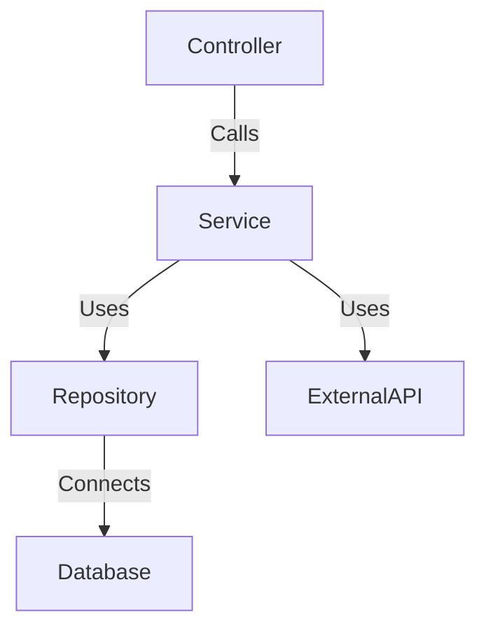

# E-commerce API

## Description
This API provides basic functionalities for an e-commerce system, including user management, products, shopping cart, and orders. It uses **Spring Boot**, **Spring Data JPA**, **Hibernate**, and **JWT** for authentication.

## Technologies Used
- Java 23+
- Spring Boot 3+
- Spring Data JPA
- Hibernate
- PostgreSQL/MySQL
- Spring Security with JWT
- Swagger for documentation

## Architecture
This project follows a **Hexagonal Architecture (Ports and Adapters)** approach to separate business logic from external dependencies.

### **Layers**:
- **Application Layer**: Contains use cases (services) and orchestrates the business logic.
- **Domain Layer**: Contains core business logic and entities, following the **DDD (Domain-Driven Design)** principles.
- **Infrastructure Layer**: Manages external dependencies such as databases, APIs, and security.
- **Adapters**: Provide implementations for database access, external API integrations, and authentication.

### **Component Interaction**

This structure ensures a clean separation of concerns, making the system scalable and maintainable.

## Requirements
- JDK 23+
- Maven 3+
- PostgreSQL/MySQL Database

## Installation

1. Clone the repository:
   ```sh
   git clone https://github.com/your-username/ecommerce-api.git
   cd ecommerce-api
   ```

2. Configure **application.properties** or **application.yml**:
   ```properties
   spring.datasource.url=jdbc:postgresql://localhost:5432/ecommerce
   spring.datasource.username=your-username
   spring.datasource.password=your-password
   spring.jpa.hibernate.ddl-auto=update
   ```

3. Build and run the project:
   ```sh
   mvn clean install
   mvn spring-boot:run
   ```

## API Usage
The API exposes endpoints for e-commerce management. Swagger documentation is available at:
```
http://localhost:8080/swagger-ui/index.html
```

### Main Endpoints

#### **Authentication**
- `POST /auth/register` - Register a user
- `POST /auth/login` - Login and generate JWT token

#### **Products**
- `GET /products` - List available products
- `POST /products` - Add a new product (**Requires ADMIN**)
- `PUT /products/{id}` - Update a product (**Requires ADMIN**)
- `DELETE /products/{id}` - Remove a product (**Requires ADMIN**)

#### **Shopping Cart**
- `POST /cart/add` - Add a product to the cart
- `GET /cart` - View the user's cart
- `DELETE /cart/remove/{productId}` - Remove an item from the cart

#### **Orders**
- `POST /orders` - Finalize the purchase and create an order
- `GET /orders/{id}` - Retrieve a specific order
- `GET /orders/user/{userId}` - List user orders

## Security & Authentication
- The system uses **JWT** for authentication.
- Some routes require a **JWT token** in the header `Authorization: Bearer <token>`.
- Only administrators can manage products.

## Tests
To run unit and integration tests:
```sh
mvn test
```

## Contribution
Contributions are welcome! To suggest improvements:
1. Fork the repository
2. Create a branch (`feature/my-feature`)
3. Commit your changes (`git commit -m 'My new feature'`)
4. Open a Pull Request

## License
This project is licensed under the [MIT License](LICENSE).